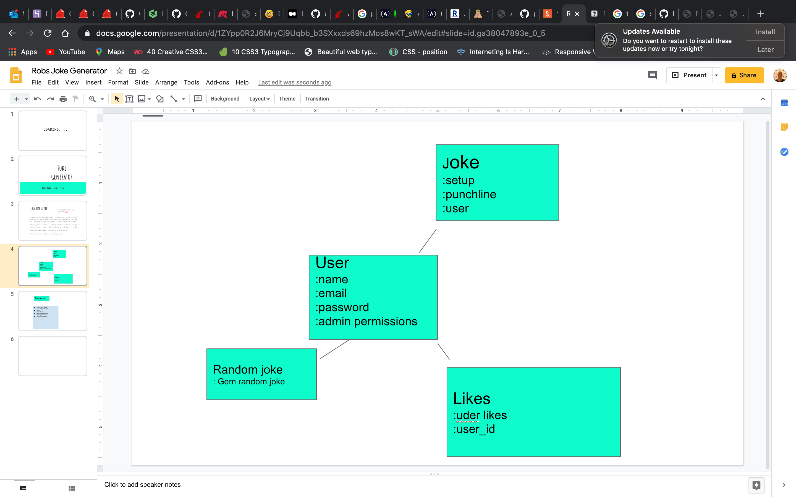

# Random Joke Generator

## Project One

### Version 1.0.0

#### Deployed to [Heroku](https://murmuring-basin-92750.herokuapp.com/)

#### Summary
This is my project from our second full project week While studying Software Engineering Immersive at General Assembly.
Over all it is week six of the course and we have covered HTML & CSS, Js, Dom, Jquery, Ruby on Rails, Sinatra, Bootstrap and other bits and pieces.

The aim of this project was to build a Frontend and Backend with at least a 3 model database structure, We got to choose our own projects and were given 1 week to deliver.

I choose to build a 3 model database where a user can sign up, create edit and add their own jokes and like other users jokes, Also I used a simple Gem to generate random Dad Jokes from the web and also generate random jokes from the database.

I would like to revisit this project and add one more model where a user can schedule random jokes to be sent to their inbox on a frequency of their choice, why you would want to I don't know, but I know it would be valuable to learn how to build this model, Also I want to set up the database so that different jokes fit into different categories/genres.

#### Contributors
- Robert Stoelhorst <robbiestoelhorst@hotmail.com>

#### Database structure



#### Technology

- Ruby on rails
- HTML & CSS
- Js, Jquery
- Bootstrap

When I set out on this project I was thinking a lot about what tools I would need to build it, I was scared about having to use Js and I got all the way to the last day of building and adding a couple of features (the random joke buttons on the home page).
Once I got a start on a very few and simple as it turns out lines of code in my Js file using Jquery the buttons functioned first try so I was happy with that.

#### Evolution
I have many ideas for what I would like to do with this app, I will first try and ground myself and build a bit more knowledge around my areas of weakness, for example Associations and Controllers and I also really want to learn how to implement API's and to better understand the Gems and how they talk to my system.

When I have a better grasp of these I should be able to build on this project much more fluently.  
I also need to go back over all of my code and make comments and think about the pseudocode much more.

I have implemented Bootstrap into this project but I didn't end up using it a lot as I needed more time to figure out how to rewrite it into my code, there was more involved than I had expected utilizing this tool.

#### What I have learned

I am much more familiar with database structure their models and migrations. I have also gained a much better understanding of gitHub and how to navigate it through the terminal without having to stop and look up commands.

In general understanding and decoding the syntax is getting better for me.

this line of code while building the likes model from a tutorial was the one that stood out as not being clear to me.
from my joke.rb file
```!!self.likes.find{|like| like.user_id == user.id}```

## License & copyright
© Robert D Stoelhorst, General Assembly
